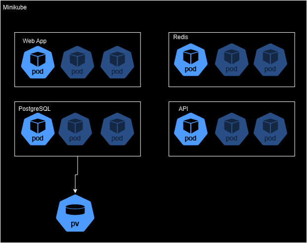

# 8INF700 - Projet final 

## Architecture
Tous roule dans un node Minikube, chaque service utilise des "Horizontal Pod Autoscaler". Le service PostgreSQL utilise un volume persistent pour ses données.   

Le schéma suivant donne une idée de l'arrangement, les pods plus pâle sont les répliques possible via le HPA.

## Fichiers Docker

Dockerfile-api - Fichier Dockerfile pour créer l'image de l'API
Dockerfile-client - Fichier Dockerfile pour créer l'image de l'app web

## Fichiers YAML

*-deployment.yaml - Fichier pour la configuration d'un Deployment kubernetes
*-hpa.yaml - Fichier pour la configuration du Horizontal Pod Autoscaling pour un service
*-ingress.yaml - Fichier pour la configuration de l'accès externe d'un service
*-service.yaml - Fichier pour la déclaration d'un service pour rendre un deployment visible dans un node
*-claim.yaml - Fichier de configuration pour un Persistent Volume Claim
*-pv.yaml - Fichier de configuration pour un Persistent Volume
*-secret.yaml - Fichier de configuration pour un stockage de secret

## Autres Fichiers

Locustfile.py - Fichier de configuration pour l'utilitaire Locust pour des test de charge

## Commandes utilisés
1. minikube start - Pour lancer minikube
2. kubectl apply -f ./[service] - Utilise les fichiers dans un dossier pour créer les fonctions nécessaire aux services
3. kubectl get hpa -w - Permet de monitor les HPA pour valider leur fonctionnement lors de test de charge.
